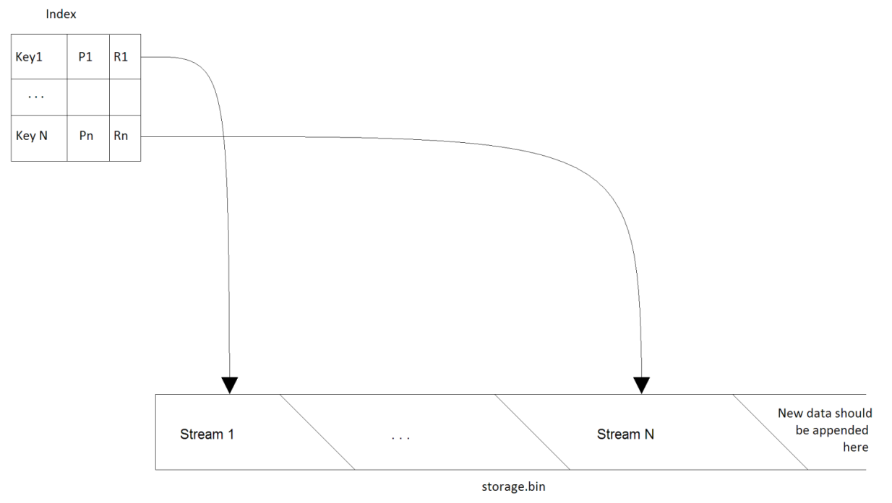

# Binary Storage

## Introduction

**Binary Storage** is a write once read many data structure stored on the hard drive. It should provide persistent storage for arbitrary binary content (stream of bytes). When adding new data to the storage client provides a string key that will be associated with this data. Once added to the storage the data cannot be modified through storage API. After data has been successfully added to the storage client could request it for reading by key and it should be returned as a stream of bytes. The storage should be thread-safe and should support multi-threaded addition of new data and reading of existing data. Logical organization of the **Binary Storage** is presented on the picture below:

 

It consists of two logical parts **Index** and **Storage File.**

- **Storage File** is a plain file on the disk (_storage.bin_) where all binary streams are stored. New data should be appended to the end of the storage file.
- **Index** is a persistent data structure that is used to associate keys (Ki) with streams by means of references (Ri). The reference is simply a pair of byte offset within the Storage File and size of data also in bytes. All information (Pi) required for a normal operation of the Binary Storage should also be stored in the Index. Pi can be hash value of the content, CRC code or a combination of any other properties.

The task is to implement the Binary Storage that satisfies requirements listed below and passes acceptance criteria. The solution should be accompanied with a short description and performance measurements.  If any optional requirement is implemented, it should be mentioned in the description. Limitations, important design decisions and usage of 3rd party components should be described.

### Requirements

| Id | Description |
| --- | --- |
| 1 | The solution should be implemented in C# language using .NET 4 or higher in Visual Studio 2010-2015.  Use of 3rd party libraries should be minimal and limited to open source public libraries. All sources should be provided. Solution should be standalone and should not require any additional software installed on the host machine like MS SQL Server, MS Message Queue, etc. |
| 2 | _IBinaryStorage_ interface should be implemented in a class called _BinaryStorage._ See attached Visual Studio solution. |
| 3 | In the attached solution, _TestApp_ project should not be modified. It will be used to test the code against the large set of files. |
| 4 | The solution can use as much memory as the host system provides. But it should work on the systems with 1Gb of RAM and should not fail with OutOfMemory exceptions. |
| 5 | Index structure should have compact representation on the disk and in the memory. It should support arbitrary amount of records and might keep frequently used records in the memory to achieve the best performance during lookups for information. Index structure should store MD5 hash of the input data calculated by Binary Storage implementation during add operation. |
| 6 | It should be possible to add a new data to the Binary Storage by providing a string key and instance that implements Stream (see _IBinaryStorage_).When disk is full a proper exception should be thrown during attempt to add new data. If data with the same key is already present in the storage a proper exception should be thrown. |
| 7 | After _IBinaryStorage_.Add method returns it should be possible to retrieve binary data as stream from the Binary Storage by providing a key (_IBinaryStorage.Get)_. The data retrieved from the storage should be exactly the same as the data previously added to the storage for persistence.It there is no data for a given key a proper exception should be thrown. |
| 8 | Adding and reading data from the Binary Storage should be thread-safe and multi-threaded. Thread-safe means that many threads might try to add data to the storage at the same time. Multi-threaded means that adding data distributed among 2 or more threads should be generally faster than adding the same data using only one thread. |
| 9 | It should be possible to check if a given key is present in the Index (_IBinaryStorage.Contains)_ |

### Acceptance Criteria

We will use the test application that will run a number of tests against provided solution. Therefore it is very important to implement API exactly as described in this document.

Your solution will be judged based on the outcome from the test as well as the source code review and supporting materials (description of the solution).

The decision will be made based on the following criteria:

- Conformance to API, requirements
- Code and design quality
- Performance
- Support for concurrency
- RAM consumed (less for the same performance is better)
- HDD space consumed for persisting data (less is better)

## Binary Storage implementation details

### Short description

The solution consists of two main parts: Index and File Storage. Interaction those two parts is encapsulated in BinaryStorage class.

Index is implemented using B-Tree data structure in BTreeIndex class. This structure is chosen since it is easy to implement and is ideally suited to the task. Also, it is often used for implementation of database indexes.

Thread-safety of the index is achieved with wrapper class ThreadSafeIndex, which is implemented using ReaderWriterLockSlim. ThreadSafeIndex is an implementation of Decorator pattern.

Implementation of BTreeIndex supports different types of node storage. Each node storage implementation should provide INodeStorage interface. In order to verify logic of the tree and design elaborating, InMemoryNodeStorage was originally implemented, which keeps the whole tree in memory. The nodes in the given realization of are stored in the List&lt;T&gt; collection.

To support large index PersistentNodeStorage is created, which stores tree index data on the disk.

Saving data to the disk is implemented in the Commit method. The format of a node on the disc:

| Keys count (int, 4 bytes) | Child count (int, 4 bytes) | Key info array | Child offset array (long[]) |
| --- | --- | --- | --- |

Length of keys array is 2\*&lt;B-Tree degree&gt;-1, length of child offset array is 2\*&lt;B-Tree degree&gt;. Where &lt;degree&gt; is special characteristic of the tree. Child offset is a child node offset in the index file. Key info array contains offset to index data and size of an original key itself.

Key info structure format:

| Key size (int, 4 bytes) | Index data offset (long, 8 bytes) |
| --- | --- |

Index data is stored in the same file and has format:

| Original key byte array (byte[]) | Data size (long, 8 bytes) | Data offset (long, 8 bytes) | Md5 hash byte array (bytes[16]) |
| --- | --- | --- | --- |

Original key byte array is UTF8 encoded string. Length of the array depends on length of original key. Data size – size of stored data, data offset – offset of stored date in the storage file. Md5 hash byte array – hash of stored data.

If you try to add a duplicate key to the index, DuplicateException is thrown.

Data storage logic is implemented in the FileStorage class. To read and write data to the storage used MemoryMappedFile. This class is used because it supports multi-threading read and write out of the box. Also, this class takes over memory management, which makes life easier. The only drawback – the class is not able to dynamically expand its capacity, and therefore, when the limit is reached, it is necessary to reinitialize it with new capacity. To reduce the number of reinitialization, size of the file is increased twice when the limit is reached. The corresponding logic is implemented in the EnsureCapacity method. Thread safe of this operation is ensured by ReaderWriterLockSlim. When reinitialization happens no one can read or write to the storage. It is the only bottleneck in this solution. To mitigate it, the initial storage size is set to 1 GB.

FileStorage implementation allows multithreaded appending when appending seekable stream. This is achieved by atomic calculation of new cursor position at the beginning of the function AppendSeekableStream. In the case of non seekable stream all input streams have to be laid in one queue. It behavior is achieved by using AppendNonSeekableStream method and write-lock of ReaderWriterLockSlim instance.

In the file storage, first 8 bytes are reserved for cursor position in the file, because file size is not reflect size stored data. If disk is full, NotEnoughDiskSpaceException exception will be thrown.

To read large files on 32 bit machines FakeStream class is created. It deals with the fact that redirects the call to the Read method of used MemoryMappedFile.

In addition RedBlackTreeIndex is presented. It is implemented on the basis of the SortedDictionary. This simple class has allowed to design other parts of the project are not immersing in the details of implementation of B-Tree. Also, this index was used as a reference sample in tests.

Next fields have been added to the class StorageConfiguration:

- StorageFileName — Name for storage file.
- IndexFileName — Name for index file.
- IndexTimeout — Index lock timeout. It is used in ThreadSafeIndex.

I allowed myself to format code in BinStorage.TestApp.Program and remove unused methods as unformatted code hurts the eyes. .BinStorage.DataGenerator project is used to generate test data. BinStorage.UnitTests project contains unit tests implementations indexes and file storage.

### Measurements

Testing was done on a system.
RAM: 6GB.
Processor: Intel Quad CPU Q9450 2.66GHz
Drive: SSD Vertex3 100Gb
For tests, used data from folder RandomData2.
The solution tested with B-Tree degree equals 32, but with different initial storage capacity, reading buffer size, and threads count. First value in table represent creating storage time, second – verification time in the TestApp.
Original storage capacity: 4 GB

| 4 KB read buffer || 16 KB read buffer ||
| --- | --- | --- | --- |
| 4 threads | 1 thread | 4 threads | 1 thread |
| 00:05:22.2312752 | 00:06:44.0703104 | 00:05:03.8542659 | 00:07:19.3003195 |
| 00:01:41.5303098 | 00:03:03.9506704 | 00:01:47.2956152 | 00:03:35.1958359 |

Original storage capacity: 1 GB

| 4 KB read buffer || 16 KB read buffer ||
| --- | --- | --- | --- |
| 4 threads | 1 thread | 4 threads | 1 thread |
| 00:05:22.2721910 | 00:06:40.2220094 | 00:05:02.1190996 | 00:06:08.8918930 |
| 00:01:41.2847247 | 00:03:05.4632048 | 00:01:45.6649551 | 00:03:02.9999457 |

Testing shows that:

- reinitialization capacity of MemoryMappedFile in FileStorage class does not affect performance much.
- best performance is achieved with 16 KB read buffer.
- increasing buffer size more hurts performance, results are not presented.
- multithreaded running gives 44% performance growth for writing data with 16 KB bufferand 27% in average.
- multithreaded running gives 127% performance growth for reading data with 16 KB bufferand 116 % in average.
